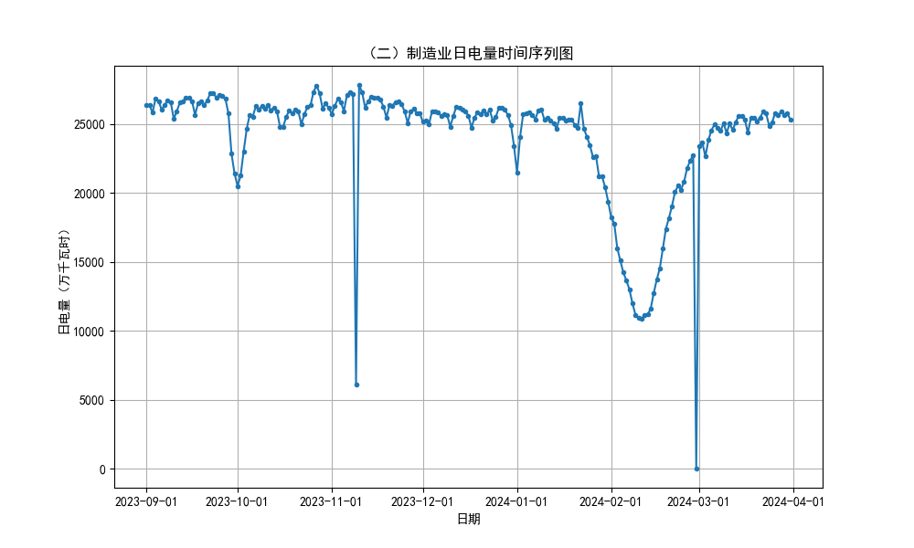
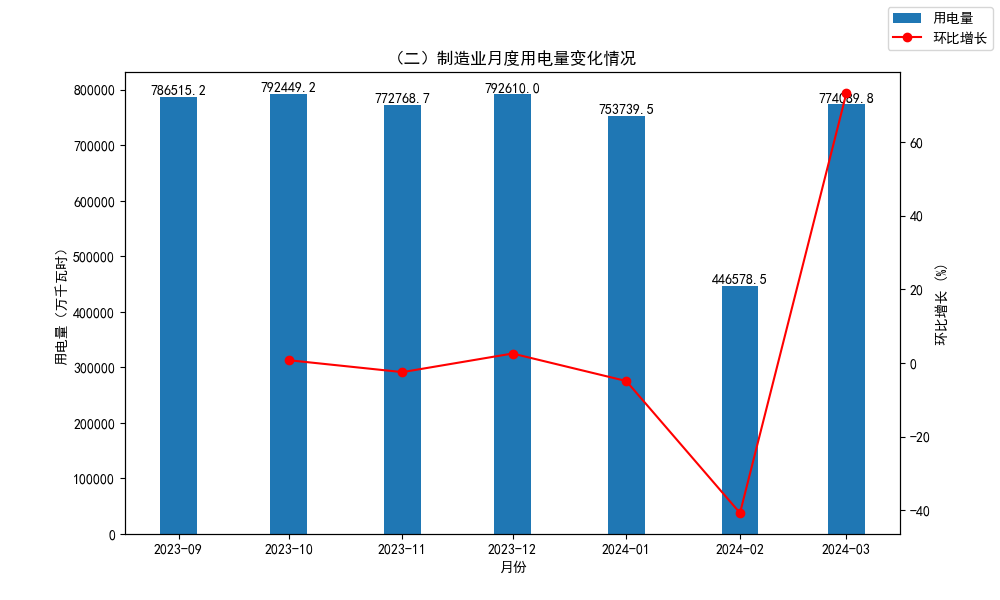
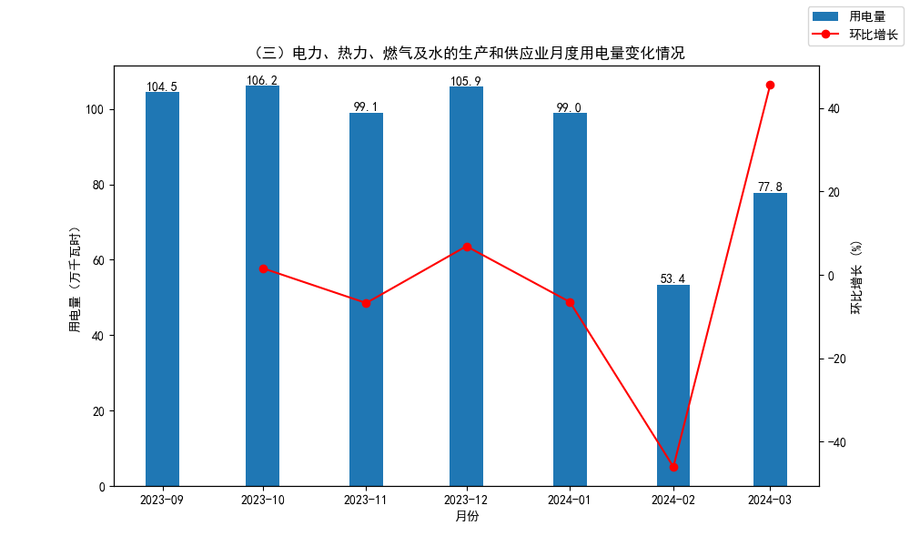
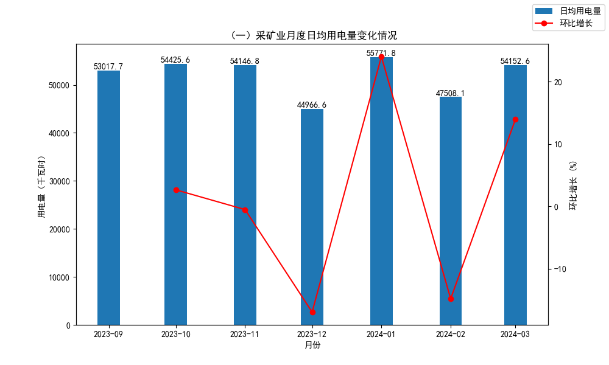

# 工业

## 一、企业日均用电量分布

_**注：采矿业企业日均用电量主要集中在10万千瓦时以下，制造业企业日均用电量主要集中在100万千瓦时以下，电力、热力、燃气及水的生产和供应业企业日电量主要集中在1万千瓦时以下。**_

## 二、日电量时序数据

_**注：工业行业的日电量在11月9日均出现大幅下跌，当天接近3000家企业的日电量为0。同时，所有企业在2月29日的日电量均存在数据缺失，因此当天的日电量均为0。**_

## 三、月度电量变化情况

### 1. 月度用电量变化情况

_**注：工业行业的月度用电量在2月均达到较低水平，其中制造业和电力、热力、燃气及水的生产和供应业在3月均出现大幅回升，只有采矿业在3月仍有小幅下降趋势。**_

### 2. 月度日均用电量变化情况

_**注：工业行业的月度日均用电量在2月均达到较低水平，然后在3月均恢复为正常用电状态。同时还注意到，采矿业的月度日均用电量在12月达到最低水平，低于2月的日均用电量。**_

## 四、月度电量时序数据(201601-202305)

/（一）采矿业月度电量时序图(201601-202305).png)
/（二）制造业月度电量时序图(201601-202305).png)
/（三）电力、热力、燃气及水的生产和供应业月度电量时序图(201601-202305).png)

_**注：采矿业月度电量整体趋势较平缓，12月、1月、2月波动明显。制造业月度电量整体有上涨趋势，年初存在周期性大幅下跌。电力、热力、燃气及水的生产和供应业月度电量在2021年4月前保持相对稳定，5月后具有明显上涨趋势，并在2023年1月达到峰值，超过5000万千瓦时，这主要来源于序号4006用户1月用电量达到峰值3917万千瓦时。**_
