# 工业

## 一、企业日均用电量分布

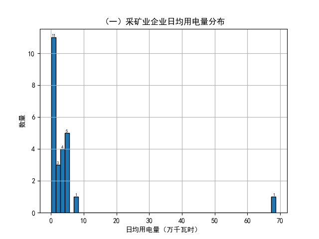
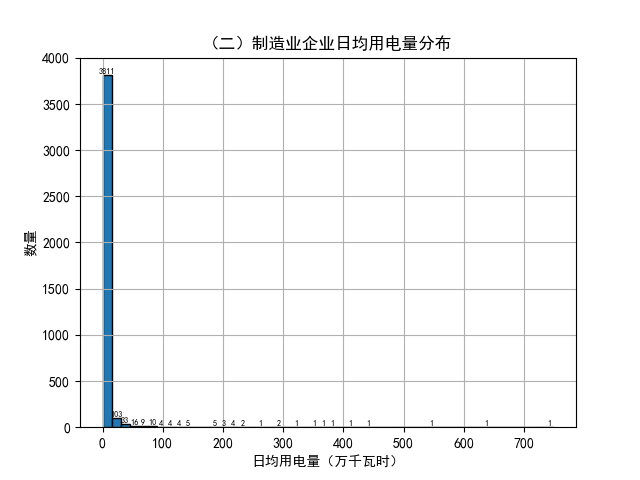
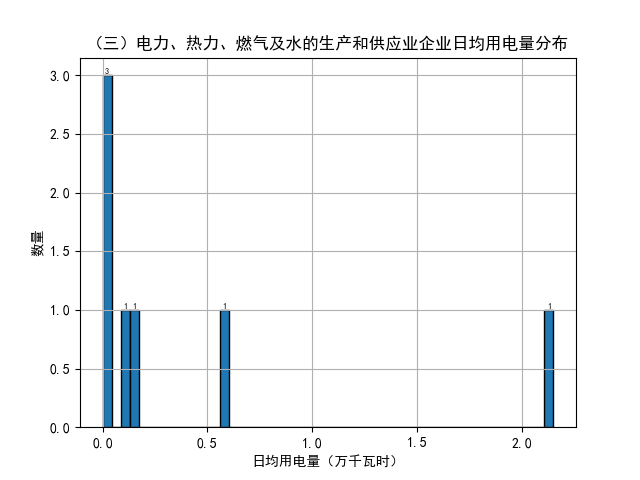

## 二、日电量时序数据

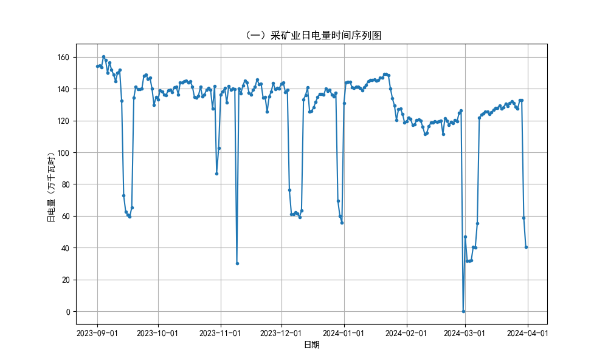
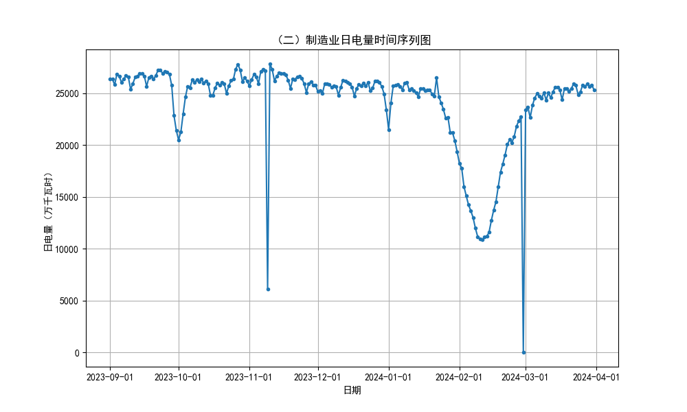
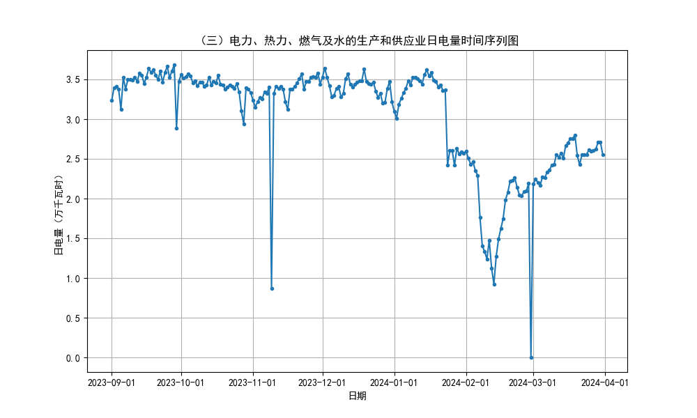

## 三、月度电量变化情况

### 1. 月度用电量变化情况

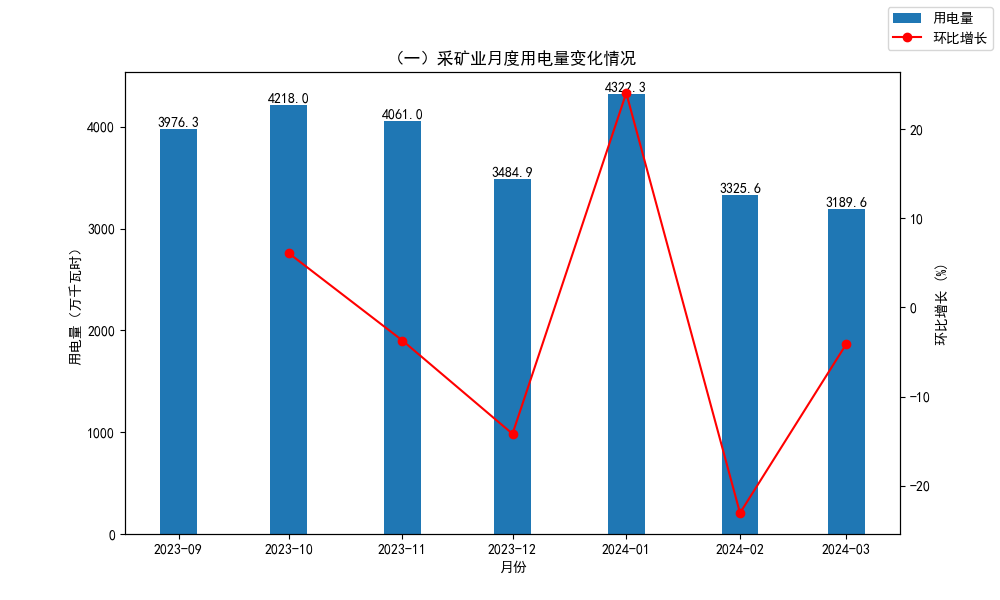
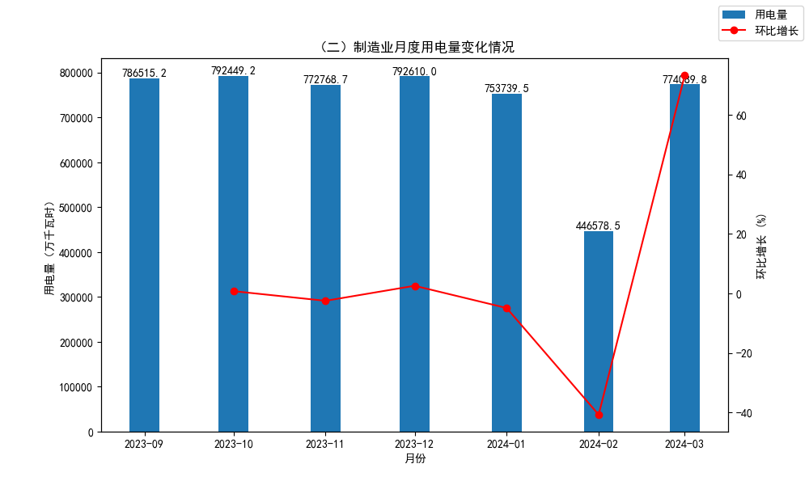
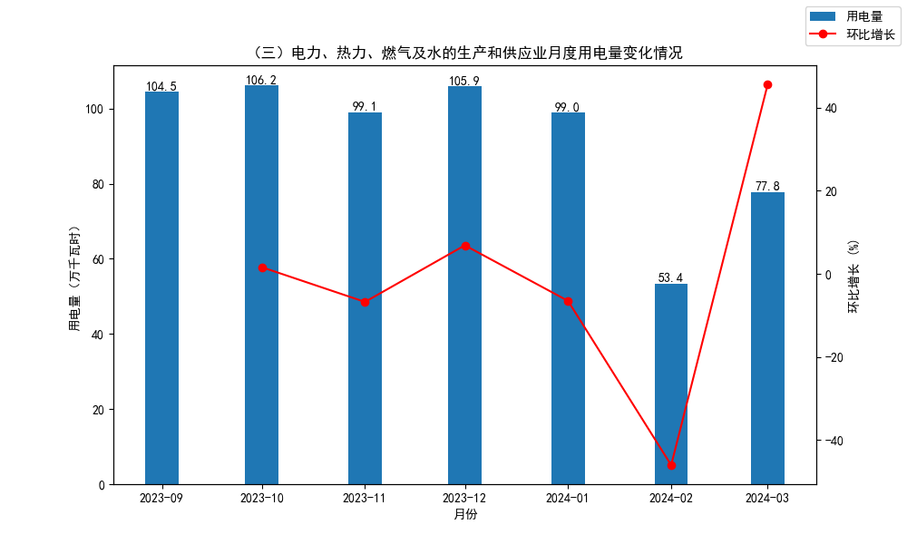

### 2. 月度日均用电量变化情况

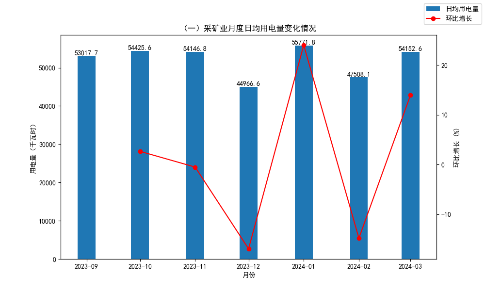
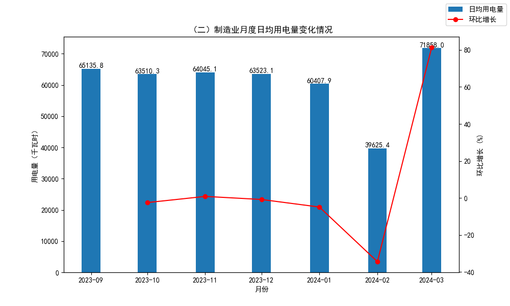
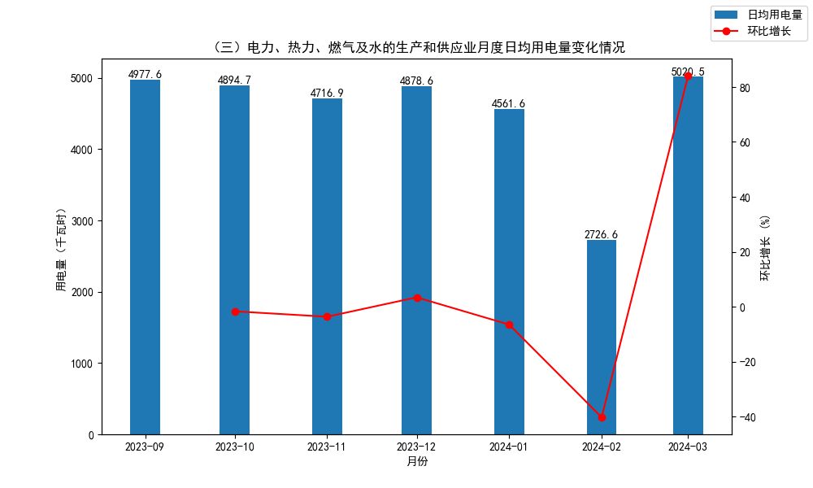

## 四、月度电量时序数据(201601-202305)

/（一）采矿业月度电量时序图(201601-202305).png)
/（二）制造业月度电量时序图(201601-202305).png)
/（三）电力、热力、燃气及水的生产和供应业月度电量时序图(201601-202305).png)

_**注：采矿业月度电量整体趋势较平缓，12月、1月、2月波动明显。制造业月度电量整体有上涨趋势，年初存在周期性大幅下跌。电力、热力、燃气及水的生产和供应业月度电量在2021年4月前保持相对稳定，5月后具有明显上涨趋势，并在2023年1月达到峰值，超过5000万千瓦时，这主要来源于序号4006用户1月用电量达到峰值3917万千瓦时。**_
