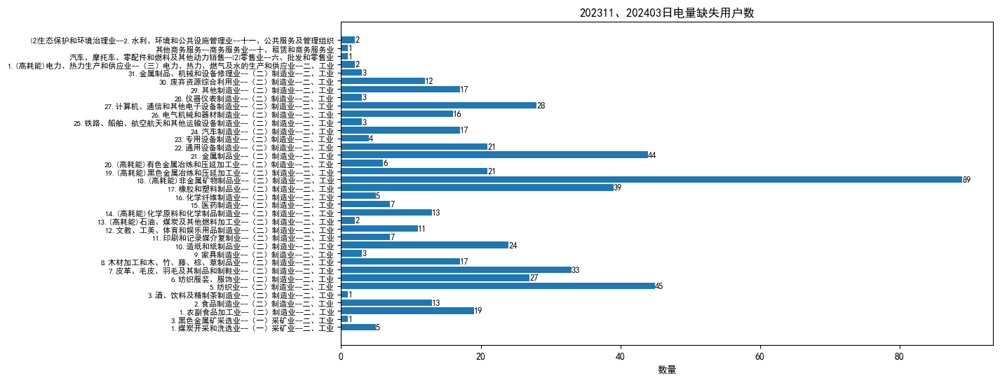
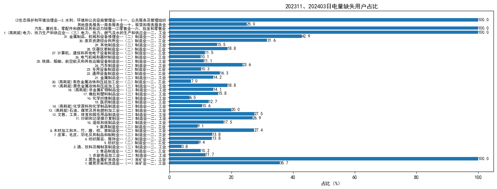

# 缺失数据统计

## 一、日电量缺失数据统计

### 1. 日电量缺失用户数统计

_**注：日电量缺失用户共计563家：其中2023年11月的日电量缺失用户共计1家，序号为3047；2024年03月的日电量缺失用户共计560家，序号为8、27、…、4056、4069；2023年11月、2024年03月的日电量均缺失用户共计2家，序号为310、4078。**_

### 2. 日电量缺失用户占比

_**注：比值为行业中存在日电量缺失用户数与该行业总用户数的比值。部分总用户数较少的行业日电量缺失比例能达到100%，大多数行业的日电量缺失比例均在40%以下。**_
