# 全国投入产出表

## 一、 新质生产力直接消耗系数

### 1. 年均增长百分比

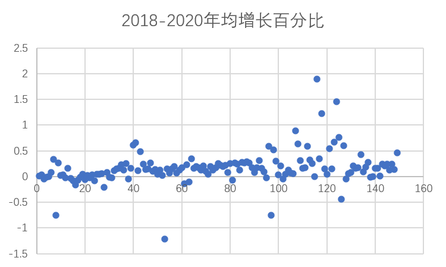
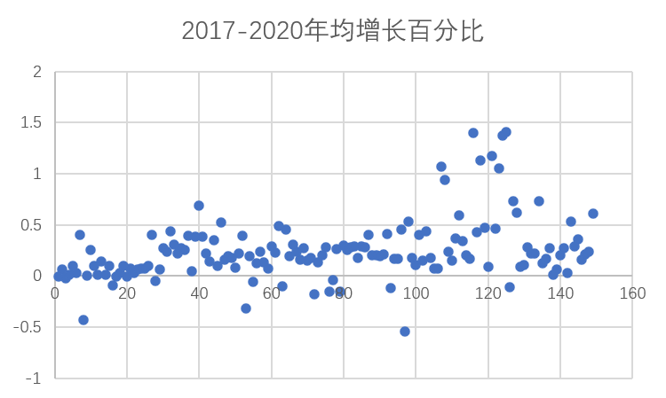
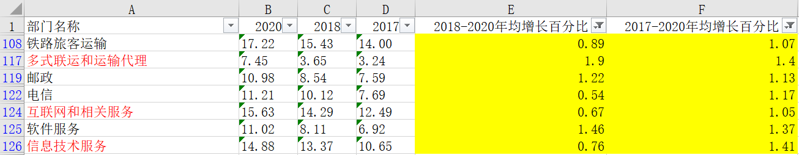

### 2. 年均增长率

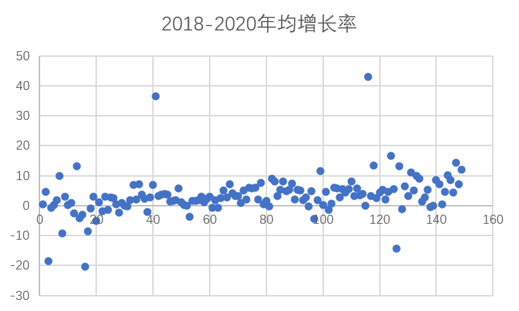
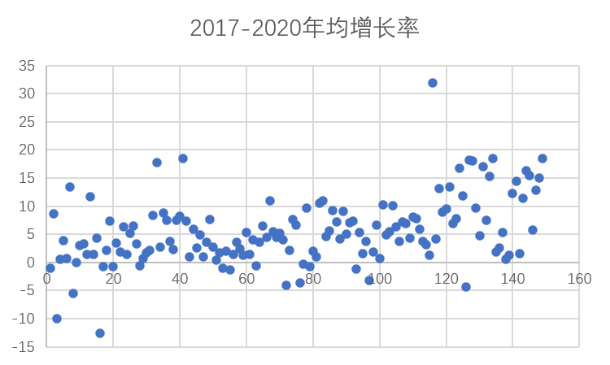
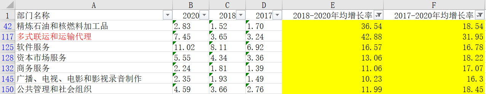

## 二、 增加值占GDP比值

### 1. 年均增长百分比
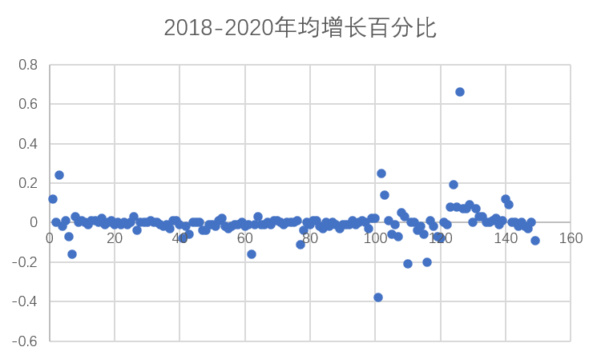

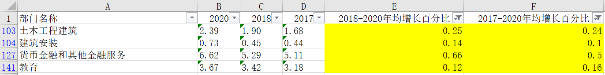

### 2. 年均增长率

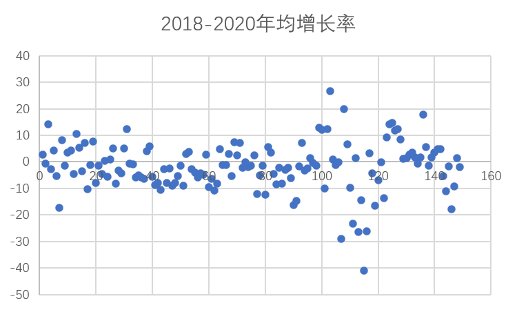
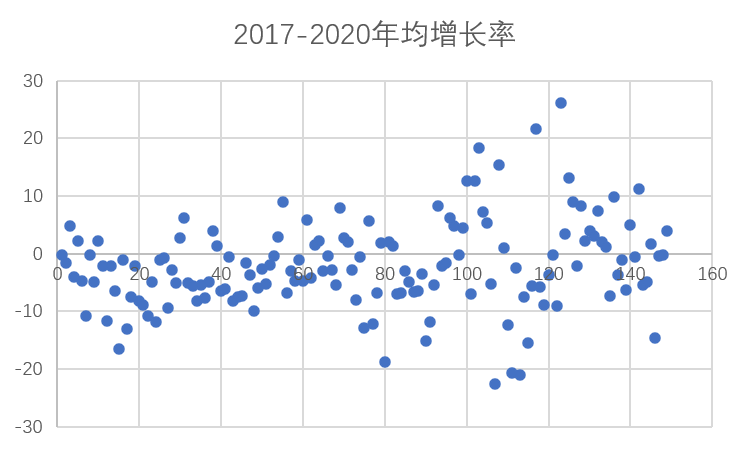
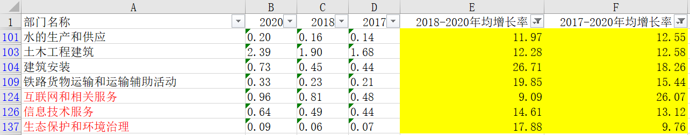

## 三、 各部门对新质部门的直接消耗系数

### 1. 2018-2020年均增长率

部门顺序：按行和从大到小排序
.png)

### 2. 2017-2020年均增长率

部门顺序：按行和从大到小排序
.png)