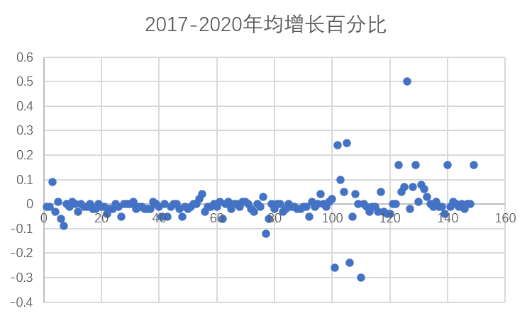

# 全国投入产出表

## 一、 新质生产力直接消耗系数

利用《全国投入产出表》，采用2017年《全国投入产出表》的149部门划分，计算2020年、2018年、2017年各部门的新质生产力直接消耗系数。

### 1. 年均增长百分比

计算各部门的新质生产力直接消耗系数年均增长百分比，并绘制散点图，选取年均增长百分比较高的部门，得到以下部门所在行业的新质化发展变化较明显，其中标红为新质部门。

### 2. 年均增长率

计算各部门的新质生产力直接消耗系数年均增长率，并绘制散点图，选取年均增长率较高的部门，得到以下部门所在行业的新质化发展速度较快，其中标红为新质部门。

## 二、 增加值占GDP比值

### 1. 年均增长百分比

### 2. 年均增长率

## 三、 各部门对新质部门的直接消耗系数

利用《全国投入产出表》，采用2017年《全国投入产出表》的149部门划分，分别计算2020年、2018年、2017年各部门对各新质部门的直接消耗系数。

再计算各部门对各新质部门的新质生产力直接消耗系数年均增长率，并绘制热图，选取年均增长率总和较高的Top10部门，主要分布在燃料加工业、运输业、燃气生产和供应业、汽车制造业等行业，同时各部门对“多式联运和运输代理”和“互联网和相关服务”等新质部门的直接依赖性有明显增强。

### 1. 2018-2020年均增长率

部门顺序：按年均增长率总和从大到小排序

.png)

### 2. 2017-2020年均增长率

部门顺序：按年均增长率总和从大到小排序

.png)