# 行业新质化发展

## 一、投入产出表相关系数

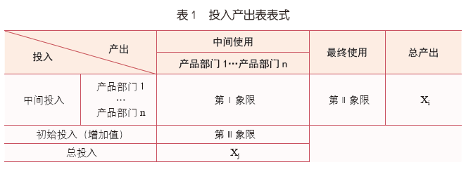

### 1.新质生产力直接消耗系数

$ 20𝑋𝑋年某部门的新质生产力直接消耗系数 = \frac{20𝑋𝑋年新质部门对该部门的投入总额}{该部门的总投入} $

表示该部门在生产活动中单位总产出直接消耗的新质部门产品或服务的价值量，它反映了该部门与新质部门之间直接的技术经济联系和直接依赖关系。
系数越大，说明该部门对新质部门的直接依赖性越强，该行业的新质化发展水平越高。

### 2.新质生产力直接消耗系数年均增长百分比

$ 20XY年-20XX年某部门的新质生产力直接消耗系数年均增长百分比 = \frac{20XX年该部门的新质生产力直接消耗系数-20XY年该部门的新质生产力直接消耗系数}{20XX年−20XY年} $

### 3.新质生产力直接消耗系数年均增长率

$ 20XY年-20XX年某部门的新质生产力直接消耗系数年均增长率 = \sqrt[n]{\frac{20XX年该部门的新质生产力直接消耗系数}{20XY年该部门的新质生产力直接消耗系数}}-1 $

### 4.增加值占GDP比值

$ 20XX年某部门的增加值占GDP比值 = \frac{20XX年该部门的增加值}{20XX年增加值总和} $

## 二、全国投入产出表

### 1. 新质生产力直接消耗系数年均增长百分比

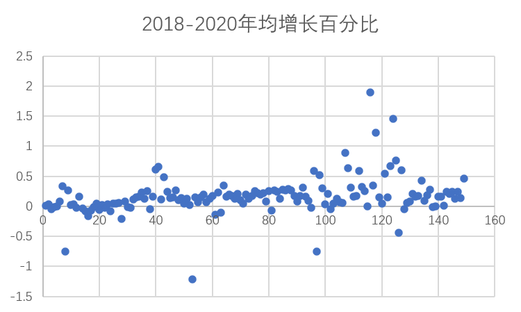
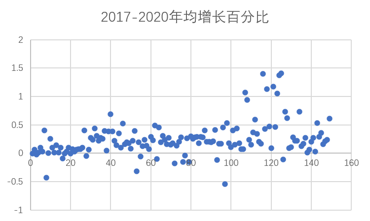
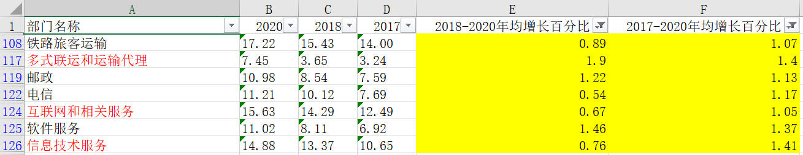

### 2. 新质生产力直接消耗系数年均增长率

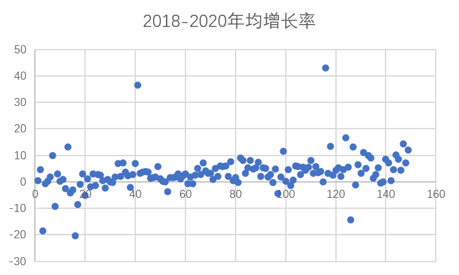
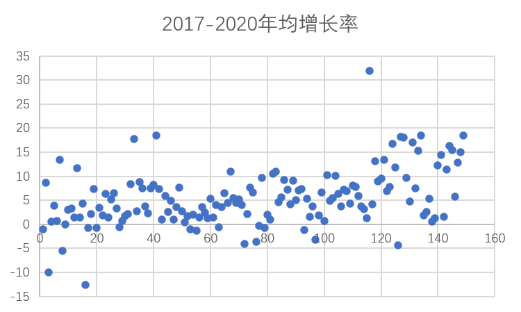
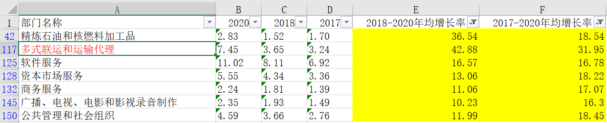

## 三、福建投入产出表

### 1. 新质生产力直接消耗系数年均增长百分比

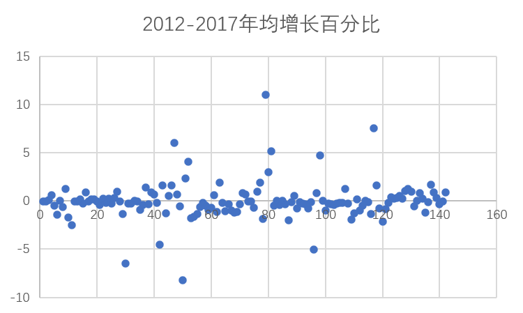
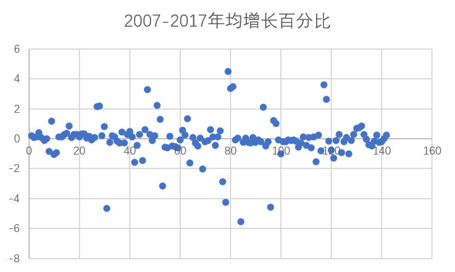
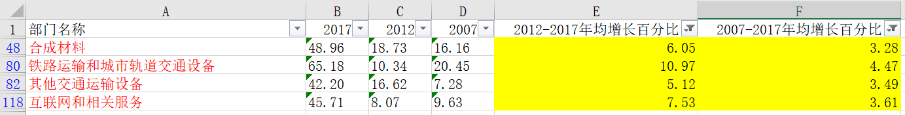

### 2. 新质生产力直接消耗系数年均增长率

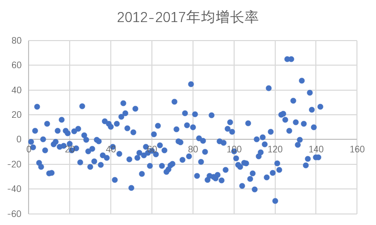
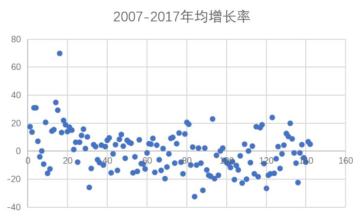
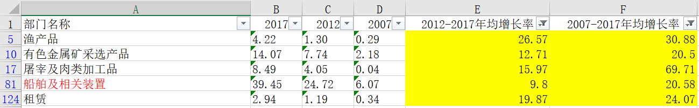