# 新质生产力

## 一、新质行业和对应部门

注：表中“部门名称”参考2020年全国投入产出表中的“部门名称”；
表中“行业”参考国民经济行业分类(GB／T+4754-2017) ，标红为新兴产业。

### 1. 其他合成材料制造

对应部门：合成材料

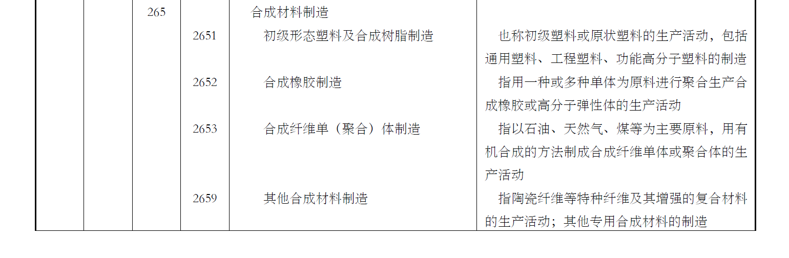

### 2. 生物基、淀粉基新材料制造

对应部门：化学纤维制品

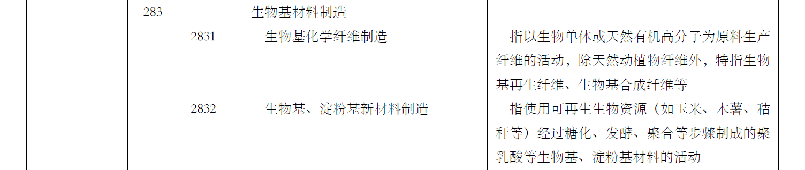

### 3. 新能源车整车制造

对应部门：汽车整车

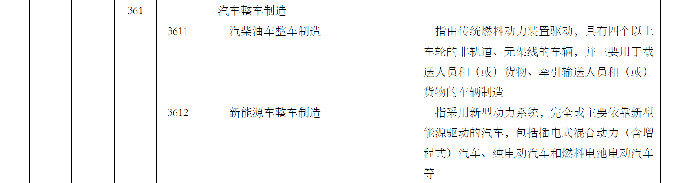

### 4. 城市轨道交通设备制造

对应部门：铁路运输和城市轨道交通设备

### 5. 船舶及相关装置制造

对应部门：船舶及相关装置

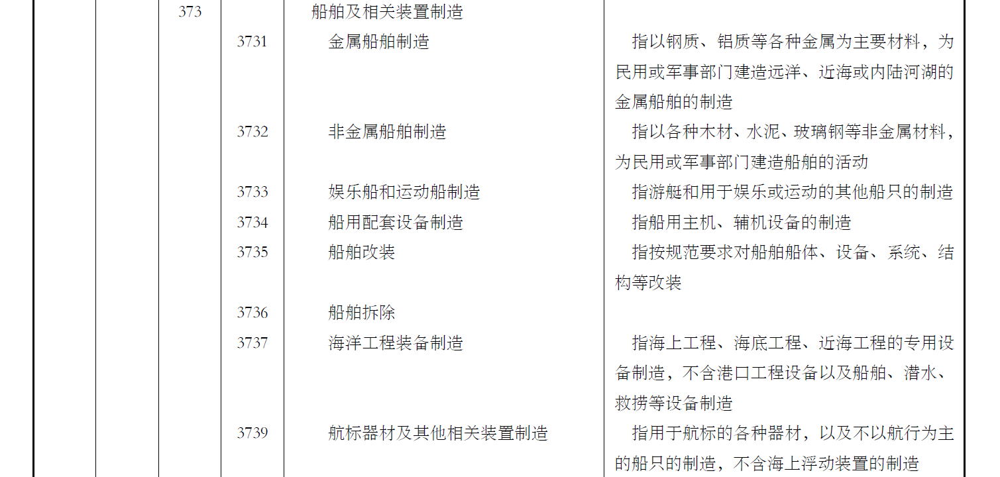

### 6. 航空、航天器及设备制造

对应部门：其他交通运输设备

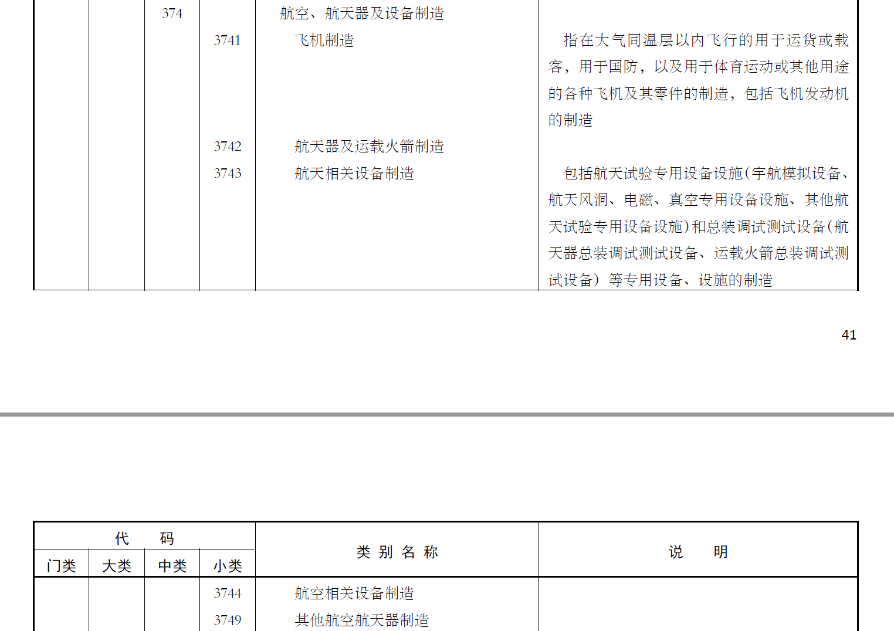

### 7. 智能消费设备制造

对应部门：其他电子设备

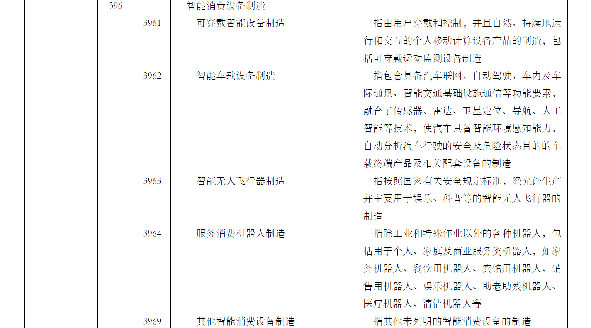

### 8. 废弃资源综合利用业

对应部门：废弃资源和废旧材料回收加工品

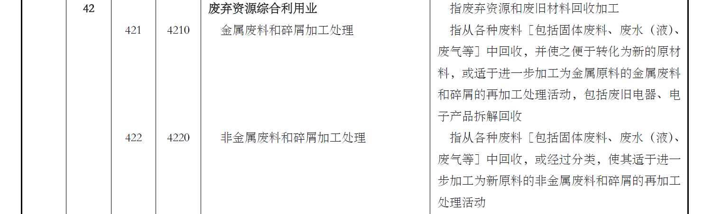

### 9. 电力生产

对应部门：电力、热力生产和供应

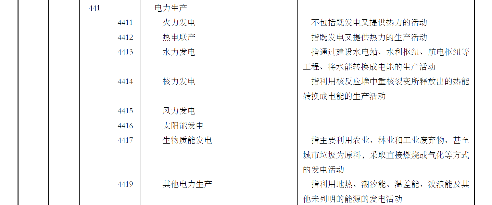

### 10. 多式联运和运输代理

对应部门：多式联运和运输代理

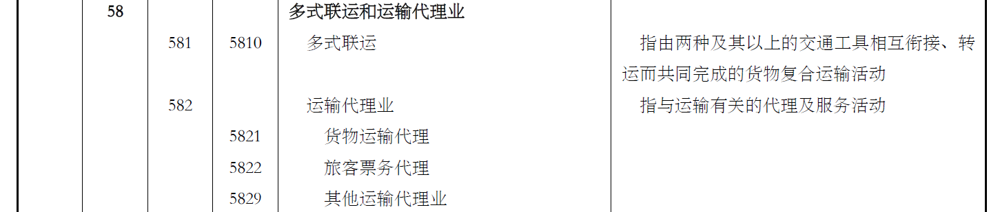

### 11. 互联网数据服务

对应部门：互联网和相关服务

### 12. 物联网技术服务

对应部门：信息技术服务

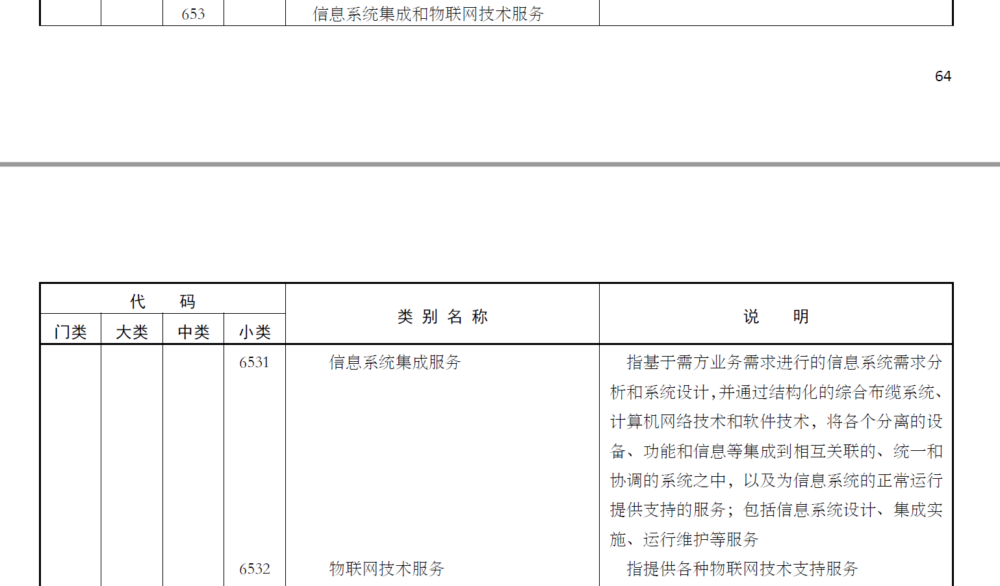

### 13. 生态保护和环境治理业

对应部门：生态保护和环境治理

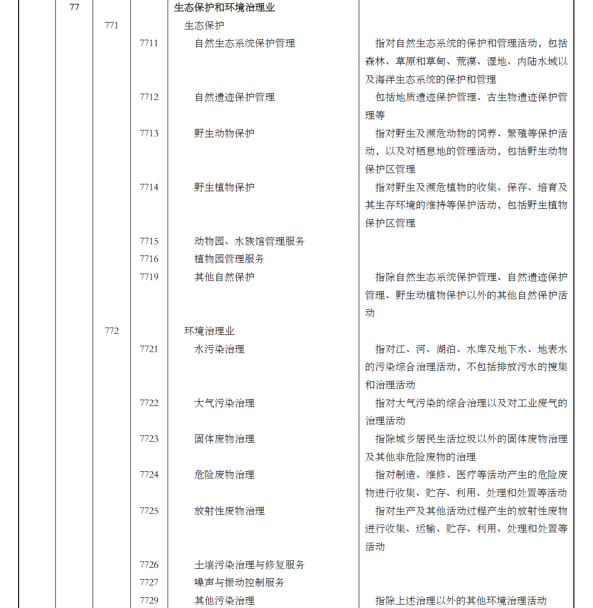
