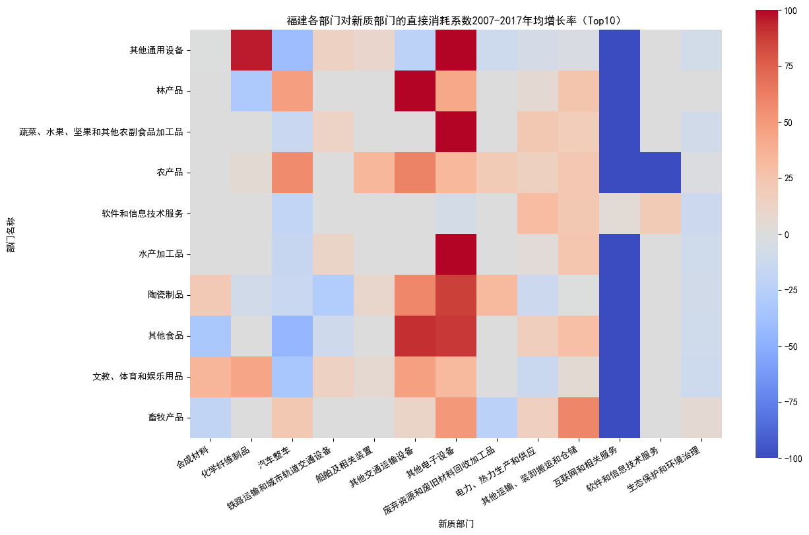

# 福建投入产出表

## 一、 新质生产力直接消耗系数

利用《福建投入产出表》，采用2017年《福建投入产出表》的142部门划分，计算2017年、2012年、2007年各部门的新质生产力直接消耗系数。

### 1. 年均增长百分比

计算各部门的新质生产力直接消耗系数年均增长百分比，并绘制散点图，选取年均增长百分比较高的部门，得到以下部门所在行业的新质化发展变化较明显，其中标红为新质部门。

### 2. 年均增长率

计算各部门的新质生产力直接消耗系数年均增长率，并绘制散点图，选取年均增长率较高的部门，得到以下部门所在行业的新质化发展速度较快，其中标红为新质部门。

## 二、 增加值占GDP比值

### 1. 年均增长百分比

### 2. 年均增长率

## 三、 各部门对新质部门的直接消耗系数

利用《福建投入产出表》，采用2017年《福建投入产出表》的142部门划分，分别计算2017年、2012年、2007年各部门对各新质部门的直接消耗系数。

再计算各部门对各新质部门的新质生产力直接消耗系数年均增长率，选取年均增长率总和较高的Top10部门，设定阈值为100，并绘制热图，主要分布在制造业、水的生产和供应业等行业，同时各部门对“化学纤维制品”和“其他电子设备”等新质部门的直接依赖性有明显增强，但是对“互联网和相关服务”和“软件和信息技术服务”等新质部门的直接依赖性有明显减弱。绝大多数部门在2017年对“互联网和相关服务”和“软件和信息技术服务”部门的直接消耗系数降为零。

### 1. 2012-2017年均增长率

部门顺序：按年均增长率总和从大到小排序

阈值:100，超过100的系数赋值100

.png)

### 2. 2007-2017年均增长率

部门顺序：按年均增长率总和从大到小排序

阈值:100，超过100的系数赋值100

.png)